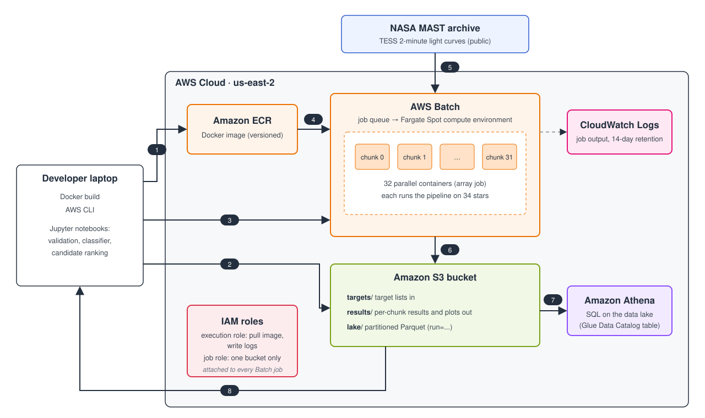

# TESS Exoplanet Detection Pipeline

An end-to-end pipeline that searches NASA's TESS telescope data for planets orbiting other stars, decides which signals look like real planets, and runs at scale on AWS.

When a planet passes in front of its star, the star dims slightly for a few hours. This is called a **transit**. TESS has recorded the brightness of hundreds of thousands of stars, and this project builds a system that finds those small, repeating dips automatically.

## Results

| What | Result |
|---|---|
| Confirmed planets recovered (SNR of 7 or more) | **90%** (376 of 419) |
| Telling planets apart from false positives | **0.94 ROC AUC** (5-fold cross-validation) |
| Unconfirmed TESS candidates ranked | **403** (76 high priority, 101 likely impostors) |
| Cloud run, 1,066 stars | **4.5 hours** on AWS Batch vs. 11 hours on a laptop |
| Cloud vs. laptop reproducibility | **933 of 933** stars reached the same verdict |

## How it works

**NASA light curves → clean → flatten, find, mask, flatten → measure 19 features → classify → ranked candidates**

### 1. Detection

For each star, the pipeline:

1. **Downloads** NASA's light curves (brightness over time), choosing sectors close together in time.
2. **Cleans** the data. It trims the first day after every gap in the data, where instrument glitches tend to appear, and removes only upward spikes, because transits only ever make a star dimmer.
3. **Removes the star's slow brightness changes** (detrending), so the short dips stand out.
4. **Searches for repeating dips** with Box Least Squares (BLS). BLS tries thousands of possible orbital periods. For each one, it folds the data at that period and checks how well a box-shaped dip fits.
5. **Detrends again** with the transits masked. The first pass can partly erase transits, especially next to gaps in the data, so the pipeline finds the transits first and then protects them. I call this **Flatten, Find, Fence, Flatten**.
6. **Measures** the period, depth, signal-to-noise ratio, and reliability flags.

### 2. Classification

Many signals that look like planets are actually **eclipsing binaries**, which are two stars orbiting and blocking each other. The pipeline turns the clues that give them away into numbers, including:

- **Shape.** Planets make U-shaped dips. Two similar-sized stars often make V-shaped ones.
- **Odd vs. even dips.** A binary found at half its true period alternates between deep and shallow eclipses.
- **A second dip halfway through the orbit**, when the companion star passes behind.
- **Timing.** Does the dip last as long as a planet around *this* star should?
- **Noise patterns** left by variable stars, and **shifts in where the light comes from** on the detector, which point to a nearby binary.

A random forest combines these 19 features. I checked that it learned real physics and not a shortcut. Confirmed planets tend to be the big, easy ones, so a model could learn "strong signal = planet." With the signal-strength features removed, it still reaches 0.92, and it works just as well on weak signals as on strong ones.

### 3. Running in the cloud

The pipeline is packaged with **Docker** and runs on **AWS**:



1. The Docker image is built locally and pushed to **ECR**.
2. The list of target stars is uploaded to **S3**.
3. An **AWS Batch** array job is submitted.
4. Batch starts 32 containers on **Fargate Spot**, each pulling the image from ECR.
5. Each container downloads its stars' light curves from NASA's **MAST** archive.
6. Each container uploads its results to S3, and its logs go to **CloudWatch**.
7. The combined results are stored as partitioned Parquet and queried with SQL in **Athena**.
8. The results come back to the notebooks for training the classifier and ranking candidates.

| Service | What it does here |
|---|---|
| **ECR** | Stores the versioned Docker image |
| **AWS Batch on Fargate Spot** | Runs 32 copies of the container in parallel on discounted spare capacity |
| **S3** | Holds the target lists, results, and a partitioned data lake |
| **IAM** | Gives each job only the permissions it needs, limited to one bucket |
| **CloudWatch Logs** | Keeps each job's output for debugging |
| **Athena** | Runs SQL queries directly on the Parquet results in S3 |

## Things that went wrong, and what they taught me

Most of the pipeline's design came from fixing problems:

- **Detrending was erasing transits.** A diagonal streak in the folded data showed one transit had been partly wiped out next to a gap. Masking the transits and detrending again fixed it.
- **An instrument glitch fooled the search.** For Pi Mensae, BLS reported a confident 13.8-day "planet" that was really a single glitch. BLS always returns an answer, so the data has to be cleaned and every result checked.
- **Some training labels were wrong.** For 36 "confirmed planets," the pipeline had actually measured noise or the wrong period. Removing them improved the classifier.
- **The cloud run was slower than expected.** A timeline of the 32 jobs showed three causes: the account's limit on how many jobs could run at once, slow jobs bunched together because of how the targets were ordered, and slower cloud CPUs.
- **An error message pointed at the wrong culprit.** Searches crashed with grids of "38 million" periods. The real grid was far smaller. The library was checking the size of its own default grid, even when given a custom one.

## Known limitations

- **Very variable stars** can hide a planet, because their own brightness swings survive detrending.
- **Brown dwarfs and small stars** are about the size of Jupiter, so their transits can look exactly like a hot Jupiter's. Only a mass measurement can tell them apart.
- **Only stars with 2-minute TESS data** are covered, which leaves out about 20% of false positives and many fainter stars.
- **Classifier scores are a ranking, not true probabilities**, because the model was trained on a balanced set of examples.
- **The SNR threshold of 7** follows NASA's convention rather than being calibrated for this pipeline.

## Repository structure

```
tess-transit-pipeline/
├── src/
│   ├── pipeline.py      # detection: fetch, clean, detrend, search, measure
│   ├── features.py      # vetting features for the classifier
│   ├── batch.py         # runs many stars, compares against the TOI catalog
│   └── run.py           # command-line entry point (used by Docker and AWS Batch)
├── notebooks/
│   ├── 01_first_transit.ipynb         # finding two planets by hand
│   ├── 02_pipeline_validation.ipynb   # automated pipeline, with pass/fail checks
│   ├── 03_benchmark.ipynb             # 100-star benchmark and training set
│   ├── 04_features.ipynb              # testing the features
│   ├── 05_classifier.ipynb            # the classifier and candidate ranking
│   └── 06_cloud_check.ipynb           # AWS run, reproducibility, data lake
├── infra/               # IAM policies for the AWS setup
├── Dockerfile
└── requirements.txt
```

The notebooks are the best place to follow the reasoning behind each step.

## Running it

**Locally** (Python 3.13):

```bash
pip install -r requirements.txt
python -m src.run --targets "WASP-18" "pi Men" --name demo --max-sectors 1
```

Results are saved to `data/demo/`. To run the notebooks, also install `jupyter` and `scikit-learn`.

**With Docker:**

```bash
docker build -t tess-pipeline .
docker run --rm -v "$(pwd)/data:/app/data" tess-pipeline --targets "WASP-18" --name demo --max-sectors 1
```

**At scale,** `run.py` can process one chunk of a large target list with `--chunk-size`. On AWS Batch, each copy of the job automatically takes its own chunk.

## Next steps

- Infrastructure as code with Terraform, and automated builds with GitHub Actions
- An interactive app for browsing the ranked candidates
- Searching for a second signal after masking the first, to recover planets hidden behind stellar variability
- Supporting TESS full-frame-image data to cover many more stars

## Data and credits

- Light curves from NASA's **TESS** mission, accessed through the **MAST** archive at STScI
- Dispositions from the **TESS Objects of Interest** catalog at the **NASA Exoplanet Archive**
- Built with lightkurve, Astropy, NumPy, pandas, and scikit-learn

## Author

**Syed Emaad Hasan**
